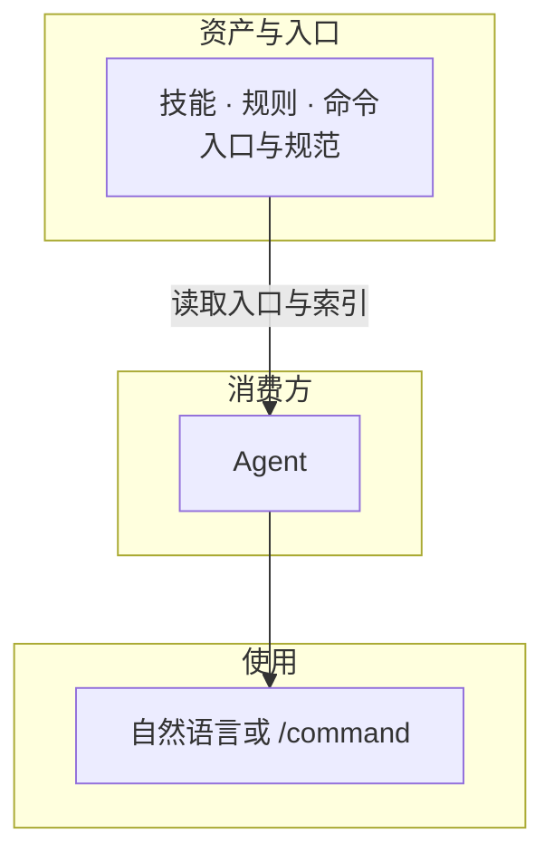

# AI Cortex /ˈkɔːrteks/


[](manifest.json)
[](LICENSE)
[](llms.txt)
[](docs/vision.md)

**Spec 驱动的 Skills/Rules/Commands 资产库**：可复用能力由规范与测试保障。详见 [愿景](docs/vision.md)、[逻辑架构](docs/architecture.md)。



---

## 项目导航

### 核心能力库

- **[技能库](skills/INDEX.md)**：脱敏、README 生成等任务能力。
- **[规则库](rules/INDEX.md)**：中文规范、安全策略等行为约束。
- **[快捷命令](commands/INDEX.md)**：快捷触发能力组合。

### 快速开始

| 方式 | 适用 | 操作 |
| :--- | :--- | :--- |
| **提示词** | 任意 Agent，零安装 | 复制下方提示词发给 Agent；资产从 Raw URL 按需加载。详见 [快速开始与使用](docs/getting-started.md)。 |
| **Cursor / TRAE** | 使用 Cursor 或 TRAE | 运行安装脚本，将规则/命令/技能写入项目或用户目录。见下节。 |

**提示词（复制发给 Agent）**

```text
读取 https://raw.githubusercontent.com/nesnilnehc/ai-cortex/main/AGENTS.md，按指引发现并加载 skills/INDEX.md、rules/INDEX.md、commands/INDEX.md，后续按需使用 AI Cortex。无 AGENTS.md 则可在项目内创建并引用本库；有则追加引用。
```

### Cursor / TRAE 安装与卸载

**无需克隆**：下载安装脚本并执行，脚本会自动拉取仓库内容。**不传参数即交互式**，按提示选择 target/scope/preset。输出目录：**Cursor** `.cursor/{rules,commands,skills}`，**TRAE** `.trae/{rules,commands,skills}`。脚本按安装清单卸载，不误删用户文件。

- **安装**（不传参数则交互式；无本地仓库时脚本会从 GitHub 下载）：

```bash
curl -sL https://raw.githubusercontent.com/nesnilnehc/ai-cortex/main/scripts/install.py | python3 -
```

- **卸载**（须与安装时 `--scope` 一致；用户级加 `--scope user`；可先 `--dry-run`）：

```bash
curl -sL https://raw.githubusercontent.com/nesnilnehc/ai-cortex/main/scripts/uninstall.py | python3 - --target cursor
```

用户级安装/卸载时在命令末尾加 `--scope user`。项目级卸载可加 `--project-dir /path/to/project`。

> Cursor User Rules 在设置页管理；脚本会生成 `~/.cursor/ai-cortex/user-rules.md` 供复制粘贴。

已克隆仓库时，可用 `python3 "$AI_CORTEX/scripts/install.py"` / `python3 "$AI_CORTEX/scripts/uninstall.py"`（将 `AI_CORTEX` 设为仓库根路径），脚本会优先使用本地仓库、不下载。需非交互（如 CI）时传 `--target`、`--scope`、`--preset`；`--preset`：`full` | `user-recommended` | `project-recommended`。换预设后重装不会自动删旧文件，需先卸载。
- **远程规则**：Cursor 支持 [GitHub 导入](https://cursor.com/cn/docs/context/rules)。

### 规范与标准

- **资产编写**：[技能](spec/skill.md) | [规则](spec/rule.md) | [命令](spec/command.md)
- **技能测试**：[测试规范](spec/test.md) — 按文档「执行清单」完成技能自检。
- **使用**：以 [AGENTS.md](AGENTS.md) 为入口，见 [快速开始](docs/getting-started.md)
- **入口撰写**：[AGENTS.md 撰写规范](skills/write-agents-entry/SKILL.md)（供他项目参考）

### 贡献

按 [技能](spec/skill.md)、[规则](spec/rule.md)、[命令](spec/command.md) 规范提交 PR；能力入口见 [skills/INDEX.md](skills/INDEX.md)、[rules/INDEX.md](rules/INDEX.md)。

### 关于项目

- **[愿景](docs/vision.md)** | **[逻辑架构](docs/architecture.md)**

发布或 fork 时请确保 `assets/`、`docs/`、`skills/` 等已一并提交。

---

[开源协议](LICENSE)
