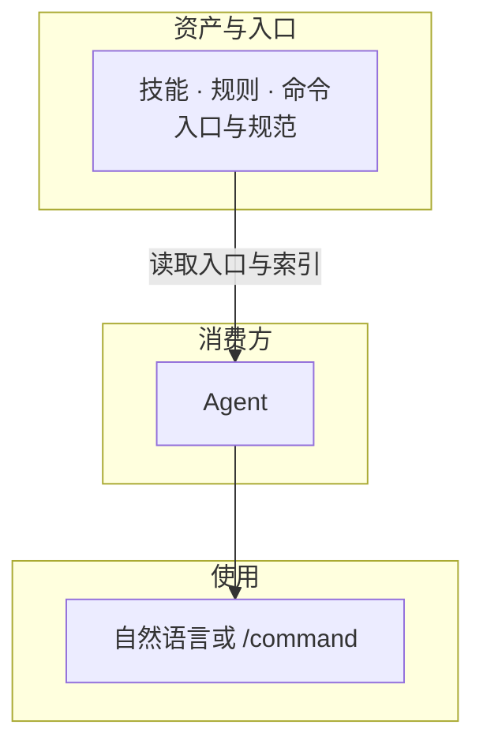

# AI Cortex /ˈkɔːrteks/


[](manifest.json)
[](LICENSE)
[](llms.txt)
[](docs/vision.md)

本项目的特色是 **规范化（Spec 驱动）** 与 **动静态集成方式**。

**规范化的、可被 Agent 发现与按需加载的** AI 技能与规则库；由 **Agent** 通过入口文件发现与使用。

- **Spec 驱动（规范化）**：资产受 Spec 约束（技能/规则/命令规范），技能含自检与测试，版本化、可追溯；贡献者与 Agent 可按 spec/test.md 对技能做自检。
- **动静态集成**：支持三种模式 `static` / `dynamic` / `auto`，默认（未设置）为 `auto`；详见 [AGENTS.md](AGENTS.md) 模式开关。通过统一入口（AGENTS.md）与索引及运行时契约（发现→注入→自检），降低提示词碎片化，适合多项目复用。

**架构概览**：Agent 通过入口（**AGENTS.md**、llms.txt、manifest.json）与索引发现本仓库资产 → 按任务发现并加载技能与规则 → 用自然语言或 /command 即可使用。流程图见下；完整 C4 架构见 [逻辑架构](docs/architecture.md)。

**本仓库绝对地址**：<https://github.com/nesnilnehc/ai-cortex>



---

## 项目导航

### 核心能力库

即用型技能、规则与命令。

- **[技能库](skills/INDEX.md)**：脱敏、README 生成等任务能力。
- **[规则库](rules/INDEX.md)**：中文规范、安全策略等行为约束。
- **[快捷命令](commands/INDEX.md)**：快捷触发能力组合。

### 快速开始

**使用方式**：让 **Agent** 读取本仓库的 [AGENTS.md](AGENTS.md) 与索引，按指引发现并加载技能与规则。无需安装脚本。

**给 Agent 的提示词**（复制以下任一条发给 Agent；URL 为本项目仓库绝对地址）：

> **说明**：以下提示词中涉及「创建/修改/删除项目内 AGENTS.md」的操作，仅在**用户已授权 Agent 写入当前项目文件**时执行；默认仅将会话内加载技能与规则，不修改磁盘文件。

- **安装/配置（默认模式）**  
  让 Agent 从 AI Cortex 的绝对地址读取 AGENTS.md 并发现索引（适合任意工作区或按需从远程拉取）。

  ```text
  读取 https://raw.githubusercontent.com/nesnilnehc/ai-cortex/main/AGENTS.md，按指引发现并加载 skills/INDEX.md、rules/INDEX.md、commands/INDEX.md，后续按需使用 AI Cortex。无 AGENTS.md 则创建并写入其内容，有则追加 AI Cortex 引用。
  ```

- **安装/配置（静态模式）**  
  安装时需将 AGENTS.md 中 `CORTEX_MODE` 设为 `static`；其余同默认模式（从绝对地址读取并发现索引）。

  ```text
  读取 https://raw.githubusercontent.com/nesnilnehc/ai-cortex/main/AGENTS.md，按指引发现并加载 skills/INDEX.md、rules/INDEX.md、commands/INDEX.md，后续按需使用 AI Cortex；CORTEX_MODE=static。无 AGENTS.md 则创建并写入其内容，有则追加引用并确保 CORTEX_MODE=static。
  ```

- **卸载**（让 Agent 停止使用并移除已加载内容）  
  **移除内容包括**：会话/上下文中已加载的 AI Cortex 技能（SKILL 内容）、规则（rules/ 下约束）、以及由 AGENTS.md 注入的操作策略与沟通准则；若曾将 AGENTS.md 或 AI Cortex 引用复制到当前项目，请从当前项目中删除该文件或其中对 AI Cortex 的引用。

  ```text
  不再遵循 AI Cortex，从会话/上下文中移除已加载的技能、规则与约束，后续不再从 https://github.com/nesnilnehc/ai-cortex 或 https://raw.githubusercontent.com/nesnilnehc/ai-cortex/main/ 加载。若项目根目录 AGENTS.md 含 AI Cortex 引用，则移除该文件或删除其中相关引用。
  ```

详见 **[快速开始与使用](docs/getting-started.md)**。

### 规范与标准

编写与集成规范，见下列 Spec。

- **资产编写**：[技能](spec/skill.md) | [规则](spec/rule.md) | [命令](spec/command.md)
- **技能测试**：[测试规范](spec/test.md)  
  **如何使用**：人工或 Agent 只需打开 [spec/test.md](spec/test.md)，按文档中的「执行清单」操作即可完成仓库内所有带测试技能的验证。贡献者在修改某技能的 SKILL 或 tests 后，可按该文档自测；Agent 在产出或修改技能时亦可按同一文档做自检。
- **分发 · 配置 · 使用**：[分发](spec/distribution.md) | [配置与使用](spec/installation.md) | [使用](spec/usage.md)

### 贡献

欢迎按 [技能](spec/skill.md)、[规则](spec/rule.md)、[命令](spec/command.md) 规范提交 PR；能力入口见 [skills/INDEX.md](skills/INDEX.md)、[rules/INDEX.md](rules/INDEX.md)。

### 关于项目

- **[愿景](docs/vision.md)** | **[逻辑架构](docs/architecture.md)**

**说明**：发布或 fork 时请确保 `assets/`、`docs/`、`skills/` 等已一并提交，否则 README 内链接与横幅图可能失效。

---

[开源协议](LICENSE)
