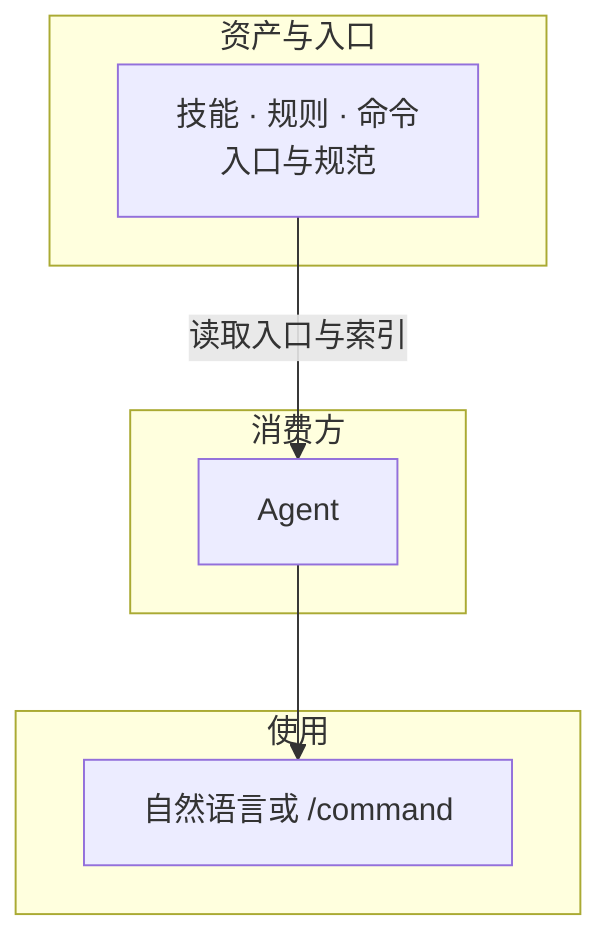

# AI Cortex /ˈkɔːrteks/


[](manifest.json)
[](LICENSE)
[](llms.txt)
[](docs/vision.md)

**Spec 驱动的 Skills/Rules/Commands 资产库**：可复用能力由规范与测试保障。详见 [愿景](docs/vision.md)、[逻辑架构](docs/architecture.md)。



---

## 项目导航

### 核心能力库

- **[技能库](skills/INDEX.md)**：脱敏、README 生成等任务能力。
- **[规则库](rules/INDEX.md)**：中文规范、安全策略等行为约束。
- **[快捷命令](commands/INDEX.md)**：快捷触发能力组合。

### 快速开始

让 **Agent** 使用本库：复制下方提示词发给 Agent。卸载及说明见 **[快速开始与使用](docs/getting-started.md)**。

**安装 / 配置**

```text
读取 https://raw.githubusercontent.com/nesnilnehc/ai-cortex/main/AGENTS.md，按指引发现并加载 skills/INDEX.md、rules/INDEX.md、commands/INDEX.md，后续按需使用 AI Cortex。无 AGENTS.md 则可在项目内创建并引用本库；有则追加引用。
```

### 规范与标准

- **资产编写**：[技能](spec/skill.md) | [规则](spec/rule.md) | [命令](spec/command.md)
- **技能测试**：[测试规范](spec/test.md) — 按文档「执行清单」完成技能自检。
- **使用**：以 [AGENTS.md](AGENTS.md) 为入口，见 [快速开始](docs/getting-started.md)
- **入口撰写**：[AGENTS.md 撰写规范](skills/write-agents-entry/SKILL.md)（供他项目参考）

### 贡献

按 [技能](spec/skill.md)、[规则](spec/rule.md)、[命令](spec/command.md) 规范提交 PR；能力入口见 [skills/INDEX.md](skills/INDEX.md)、[rules/INDEX.md](rules/INDEX.md)。

### 关于项目

- **[愿景](docs/vision.md)** | **[逻辑架构](docs/architecture.md)**

发布或 fork 时请确保 `assets/`、`docs/`、`skills/` 等已一并提交。

---

[开源协议](LICENSE)
