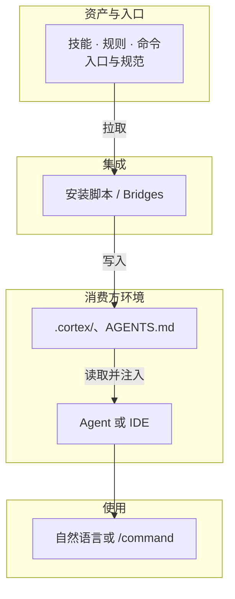

# AI Cortex /ˈkɔːrteks/


[](manifest.json)
[](LICENSE)
[](llms.txt)
[](docs/vision.md)

可插拔、可审计的 AI 技能与规则库；一行安装、规范交付，支持静态与动态集成。

**架构概览**：一行安装（或 Bridges 同步）→ 项目内出现 `.cortex/`、`AGENTS.md` → Agent/IDE 按入口发现并注入技能与规则，用自然语言或 /command 即可使用。流程图见下；完整架构见 [逻辑架构](docs/architecture.md)。



---

## 项目导航

### 核心能力库

即用型技能、规则与命令。

- **[技能库](skills/INDEX.md)**：脱敏、README 生成等任务能力。
- **[规则库](rules/INDEX.md)**：中文规范、安全策略等行为约束。
- **[快捷命令](commands/INDEX.md)**：快捷触发能力组合。

### 快速开始与使用

一行命令完成安装，使用方式见 **[快速开始与使用](docs/getting-started.md)**。

```bash
curl -sL https://raw.githubusercontent.com/nesnilnehc/ai-cortex/main/scripts/install.sh | bash
```

若需先审查再执行，可先下载脚本：`curl -sL … -o install.sh`，查看后执行 `bash install.sh`。

若从 fork 安装，将 `nesnilnehc/ai-cortex` 换成你的 组织/仓库名。需安装 `jq`。执行后生成 `.cortex/` 与根目录 [AGENTS.md](AGENTS.md)，可选注入 Bridges（脚本按环境给建议，如 GitHub、Cursor）。

**原理**：发现 → 注入 → 自检；`CORTEX_MODE` 控制资产来源（static / dynamic / auto）。

### 规范与标准

编写与集成规范，见下列 Spec。

- **资产编写**：[技能](spec/skill.md) | [规则](spec/rule.md) | [命令](spec/command.md)
- **技能测试**：[测试规范](spec/test.md)  
  **如何使用**：人工或 Agent 只需打开 [spec/test.md](spec/test.md)，按文档中的「执行清单」操作即可完成仓库内所有带测试技能的验证。贡献者在修改某技能的 SKILL 或 tests 后，可按该文档自测；Agent 在产出或修改技能时亦可按同一文档做自检。
- **分发 · 安装 · 使用 · Bridges**：[分发](spec/distribution.md) | [安装和配置](spec/installation.md) | [使用](spec/usage.md) | [Bridges](spec/bridges.md)

### 贡献

欢迎按 [技能](spec/skill.md)、[规则](spec/rule.md)、[命令](spec/command.md) 规范提交 PR；能力入口见 [skills/INDEX.md](skills/INDEX.md)、[rules/INDEX.md](rules/INDEX.md)。

### 关于项目

- **[愿景](docs/vision.md)** | **[逻辑架构](docs/architecture.md)**

**说明**：发布或 fork 时请确保 `assets/`、`docs/`、`skills/` 等已一并提交，否则 README 内链接与横幅图可能失效。

---

[开源协议](LICENSE)
