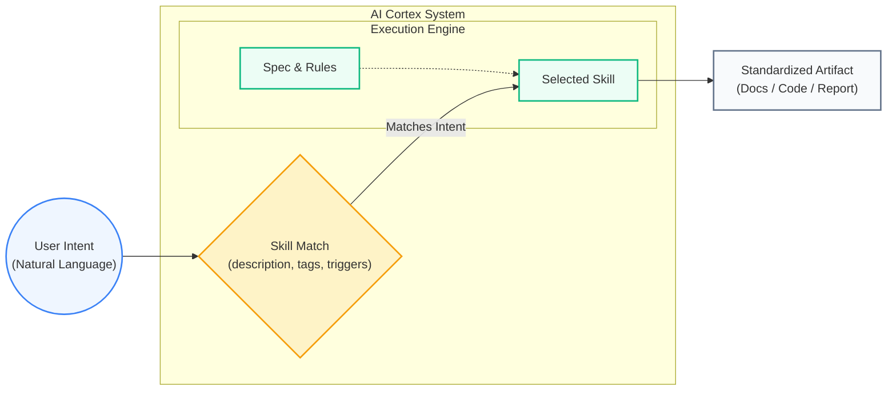

# AI Cortex

[](.)
[](LICENSE)
[](llms.txt)

> 面向 Agent 与开发者：治理资产库，包含技能、规范、约束三层，覆盖软件交付与项目治理。按 description、tags、triggers 语义匹配调用能力，按规范协作，按约束执行。详见 [使命](docs/project-overview/mission.md) 与 [愿景](docs/project-overview/vision.md)。


```mermaid
flowchart LR
    %% Style Definitions
    classDef user fill:#eff6ff,stroke:#3b82f6,stroke-width:2px;
    classDef system fill:#fef3c7,stroke:#f59e0b,stroke-width:2px;
    classDef core fill:#ecfdf5,stroke:#10b981,stroke-width:2px;
    classDef out fill:#f8fafc,stroke:#64748b,stroke-width:2px;

    %% Nodes
    Intent(("User Intent<br/>(Natural Language)")):::user
    
    subgraph Cortex [AI Cortex System]
        direction TB
        Router{"Skill Match<br/>(description, tags, triggers)"}:::system
        
        subgraph Execution [Execution Engine]
            direction LR
            Spec[Spec & Rules]:::core -.-> Skill[Selected Skill]:::core
        end
    end

    Artifact["Standardized Artifact<br/>(Docs / Code / Report)"]:::out

    %% Flow
    Intent --> Router
    Router -- Matches Intent --> Skill
    Skill --> Artifact
```

---

## ✨ 特点

- **三层治理资产**：
  - 技能 (`skills/INDEX.md`、`manifest.json`)：主动能力
  - 规范 (`protocols/INDEX.md`)：领域协议与接口契约（如 UNP/INP 通知协议）
  - 规则 (`rules/INDEX.md`)：编码与写作约束
- **Agent 优先**：无需本地文件；通过 manifest.json 远程发现和加载协议
- **规范与质量**：`spec/skill.md` 定义技能结构；`spec/artifact-contract.md` 定义制品契约
- **生态**：[skills.sh](https://skills.sh)、[SkillsMP](https://skillsmp.com)

---

## 📦 安装与使用

**技能**：
```bash
npx skills add nesnilnehc/ai-cortex
```

使用 `--force` 覆盖已有技能；`--skill <name>` 仅安装指定技能。无 Node 时见 `scripts/install-fallback.sh`。

**升级与重装**：若技能曾改名或结构变更，建议先卸载再安装：
```bash
./scripts/uninstall-reinstall-ai-cortex.sh
```

详见 [安装与重装说明](docs/references/skill-install-guide.md)。

**规则**：通过 Agent 说「将此项目规则安装到 Cursor」——或将 `rules/` 复制到 `.cursor/rules/`。见 [rules/INDEX.md](rules/INDEX.md)。

**协议**：无需安装；Agent 自动通过 manifest.json 发现和远程加载。见 [protocols/INDEX.md](protocols/INDEX.md) 及快速参考 [docs/guides/protocols-quickstart.md](docs/guides/protocols-quickstart.md)。

---

## 🚀 快速入门

1. 安装后，向 Agent 说意图（如「代码审查」「generate readme」「需求评审」）或询问「有哪些技能」。
2. Agent 按 `description`、`tags`、`triggers` 语义匹配技能；细则见 [docs/guides/discovery-and-loading.md](docs/guides/discovery-and-loading.md)。
3. 链式调用时，技能按 SKILL.md 中的 Handoff Point 相互移交。

---

## 🤝 贡献

PR 须遵循 [spec/skill.md](spec/skill.md)。更新 `manifest.json` 后运行 `npm run verify`。见 [spec/registry-sync-contract.md](spec/registry-sync-contract.md) 与 [CONTRIBUTING.md](CONTRIBUTING.md)。

---

## 📄 许可证

[MIT](LICENSE)

---

## 🙏 致谢与署名

- **贡献者**：致谢所有 [contributors](https://github.com/nesnilnehc/ai-cortex/graphs/contributors)
- **参考来源**：技能 fork/integration 自 gstack、anthropics/skills 等，完整列表见 [ATTRIBUTIONS.md](docs/references/ATTRIBUTIONS.md)
