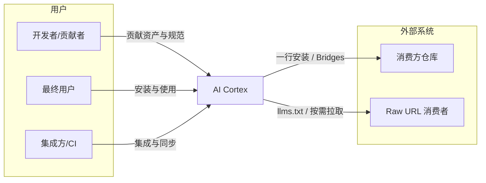
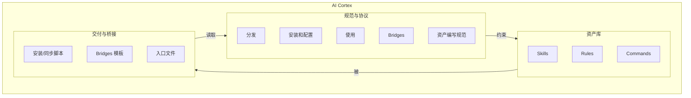

# 架构说明 (Architecture)

本文按 **C4 模型**（Context → Containers → Components）描述 AI Cortex 的项目目标与实现结构。详细愿景见 [vision.md](vision.md)。

---

## 项目目标

AI Cortex 是一个**工业级 AI 技能与规范资产库**，目标为：

- 将散乱的提示词 (Prompt) 转为**可插拔、可审计、工具无关**的逻辑模块（Skills、Rules、Commands）。
- 通过 **Spec** 定义资产的编写契约与运行时契约（分发、安装和配置、使用、Bridges），使能力具备**可预测性**与**可重复性**。
- 通过 **交付与桥接**（一行安装、Bridges、入口文件）将资产交付到消费方仓库或运行时，支持静态集成与动态自举。

---

## Level 1：系统上下文 (System Context)

系统边界及其与用户、外部系统的关系。

| 角色/系统 | 说明 |
| :--- | :--- |
| **开发者/贡献者** | 编写或维护 Skills、Rules、Commands 及 Spec；遵循 spec/skill、spec/rule、spec/command。 |
| **最终用户** | 在目标仓库执行一行安装，通过 Agent/IDE 用自然语言使用本库能力；详见 [getting-started.md](getting-started.md)。 |
| **集成方/CI** | 通过 Bridges（如 GitHub Actions、Cursor）将本库规则同步到消费方；或解析 manifest/入口文件做自动化集成。 |
| **消费方仓库** | 安装脚本与 Bridges 的产出目标（`.cortex/`、`AGENTS.md`、`.cursorrules`、`.github/workflows/` 等）。 |
| **Raw URL 消费者** | 不安装本地副本，通过 llms.txt 或 INDEX 按需拉取技能（动态自举）。 |

---

## Level 2：容器 (Containers)

系统内的高层构建块：**资产库**、**规范与协议**、**交付与桥接**。

| 容器 | 职责 | 主要产物 |
| :--- | :--- | :--- |
| **资产库** | 可调用的 AI 逻辑模块；技能、规则、命令及索引与测试。 | `skills/`、`rules/`、`commands/`，及各自 INDEX。 |
| **规范与协议** | 定义编写契约（如何写技能/规则/命令）与运行时契约（如何分发、安装、使用、桥接）。 | `spec/distribution.md`、`spec/installation.md`、`spec/usage.md`、`spec/bridges.md`、`spec/skill.md`、`spec/rule.md`、`spec/command.md`。 |
| **交付与桥接** | 将资产与规范落地到消费方；安装、同步、适配到 IDE/CI。 | `scripts/install.sh`、`scripts/sync.sh`，`bridges/`，`AGENTS.md`、`llms.txt`、`manifest.json`。 |

---

## Level 3：组件 (Components)

各容器内部的主要组件（摘要）。

### 资产库

| 组件 | 说明 |
| :--- | :--- |
| **Skills** | 主动任务逻辑（如脱敏、生成 README）；含 SKILL.md 与 tests/。 |
| **Rules** | 全局行为约束（如中文技术写作规范）；被动注入。 |
| **Commands** | 意图到技能的映射（如 `/readme` → generate-standard-readme）；供支持 Slash 命令的环境使用。 |

### 规范与协议

| 组件 | 说明 |
| :--- | :--- |
| **分发** | 渠道与交付物、入口文件（AGENTS.md、llms.txt、manifest.json）。 |
| **安装和配置** | 一行命令、安装结果、config 约定、可选 Bridges。 |
| **使用** | 运行时契约：发现、注入、自检、模式开关（CORTEX_MODE）。 |
| **Bridges** | 适配层契约：可注入的 Bridges、产出路径、如何新增。 |
| **资产编写规范** | 技能、规则、命令的 Schema 与质量要求。 |

### 交付与桥接

| 组件 | 说明 |
| :--- | :--- |
| **安装脚本** | `scripts/install.sh`：拉取 .cortex/ 与 AGENTS.md，可选注入 Bridges（含环境检测）。 |
| **同步脚本** | `scripts/sync.sh`：按 target（如 cursor）生成 .cursorrules 等。 |
| **Bridges** | `bridges/github-actions`、`bridges/cursor` 等模板与说明。 |
| **入口文件** | AGENTS.md（Agent 操作手册）、llms.txt（机器发现）、manifest.json（注册表）。 |

---

## 关系小结

- **规范约束资产**：Spec 定义资产的写法与运行时行为；资产按 Spec 编写与发布。
- **交付消费资产与规范**：安装脚本与 Bridges 将资产和入口文件写入消费方；入口文件指向规范与资产索引。
- **用户通过交付使用资产**：用户执行一行安装（或依赖 Bridges），Agent/IDE 按 AGENTS.md 与 usage 契约发现、注入、自检。
