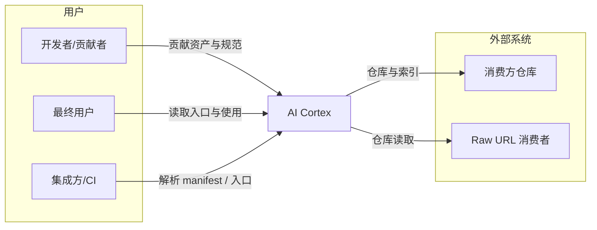
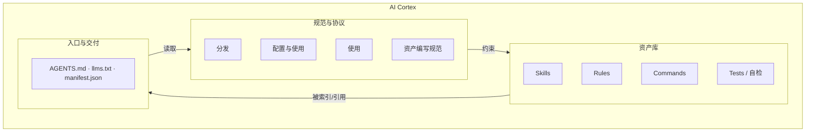

# 架构说明 (Architecture)

本文按 **C4 模型**（Context → Containers → Components）描述 AI Cortex 的项目目标与实现结构。详细愿景见 [vision.md](vision.md)。

---

## 项目目标

AI Cortex 是**Spec 驱动的 Skills/Rules/Commands 资产库**：可复用能力 + 规范与测试保障质量。目标为：

- **Spec 驱动**：编写与运行时契约 → 可发现、可注入、可验证；可预测、可重复。

---

## Level 1：系统上下文 (System Context)

系统边界及其与用户、外部系统的关系。

| 角色/系统 | 说明 |
| :--- | :--- |
| **开发者/贡献者** | 编写或维护 Skills、Rules、Commands 及 Spec；遵循 spec/skill、spec/rule、spec/command。 |
| **最终用户** | 通过 Agent 读取本库 AGENTS.md 与索引，用自然语言使用本库能力；详见 [getting-started.md](getting-started.md)。 |
| **集成方/CI** | 解析 manifest/入口文件做自动化集成；适配到具体 IDE/CI 由用户或 Agent 按需完成。 |
| **消费方仓库** | 可引用本库 AGENTS.md 或入口 URL，由 Agent 按指引发现技能与规则；无安装脚本产出。 |
| **Raw URL 消费者** | 通过 llms.txt 或 INDEX 按需拉取技能（动态自举）。 |

---

## Level 2：容器 (Containers)

系统内的高层构建块：**资产库**、**规范与协议**、**入口与交付**。

| 容器 | 职责 | 主要产物 |
| :--- | :--- | :--- |
| **资产库** | 可调用的 AI 逻辑模块；技能、规则、命令及索引与测试。 | `skills/`、`rules/`、`commands/`，及各自 INDEX。 |
| **规范与协议** | 定义编写契约（如何写技能/规则/命令/入口）与运行时约定（发现/注入/自检）。 | `spec/skill.md`、`spec/rule.md`、`spec/command.md`；入口与使用约定见根目录 `AGENTS.md`；入口撰写见 `skills/write-agents-entry/SKILL.md`（内嵌产出契约）。 |
| **入口与交付** | 供 Agent 发现与使用资产；无安装/同步脚本。 | `AGENTS.md`、`llms.txt`、`manifest.json`。 |

---

## Level 3：组件 (Components)

各容器内部的主要组件（摘要）。

### 资产库

| 组件 | 说明 |
| :--- | :--- |
| **Skills** | 主动任务逻辑（如脱敏、生成 README）；含 SKILL.md 与 tests/。 |
| **Rules** | 全局行为约束（如中文技术写作规范）；被动注入。 |
| **Commands** | 意图到技能的映射（如 `/readme` → generate-standard-readme）；供支持 Slash 命令的环境使用。 |
| **Tests / 自检** | 技能测试用例与断言（tests/）、质量检查（Self-Check）；符合 spec/test.md，支撑 TDD 与可重复性。 |

### 规范与协议

| 组件 | 说明 |
| :--- | :--- |
| **分发** | 渠道与交付物、入口文件（AGENTS.md、llms.txt、manifest.json）。 |
| **Agent 入口撰写** | AGENTS.md 的目的、结构与内容要求；见 skills/write-agents-entry/SKILL.md 内嵌「产出契约」，供他项目参考。 |
| **配置与使用** | 由 Agent 读取入口、发现资产；无安装脚本。 |
| **使用** | 运行时契约：发现、注入、自检。 |
| **资产编写规范** | 技能、规则、命令的 Schema 与质量要求。 |

### 入口与交付

| 组件 | 说明 |
| :--- | :--- |
| **入口文件** | AGENTS.md（Agent 操作手册）、llms.txt（机器发现）、manifest.json（注册表）；供 Agent 直接读取与发现资产。 |

---

## 关系小结

- **规范约束资产**：Spec 定义资产的写法与运行时行为；资产按 Spec 编写与发布。
- **入口供消费**：入口文件（AGENTS.md、llms.txt、manifest.json）指向规范与资产索引；用户让 Agent 读取入口与索引，按 usage 契约发现、注入、自检。
