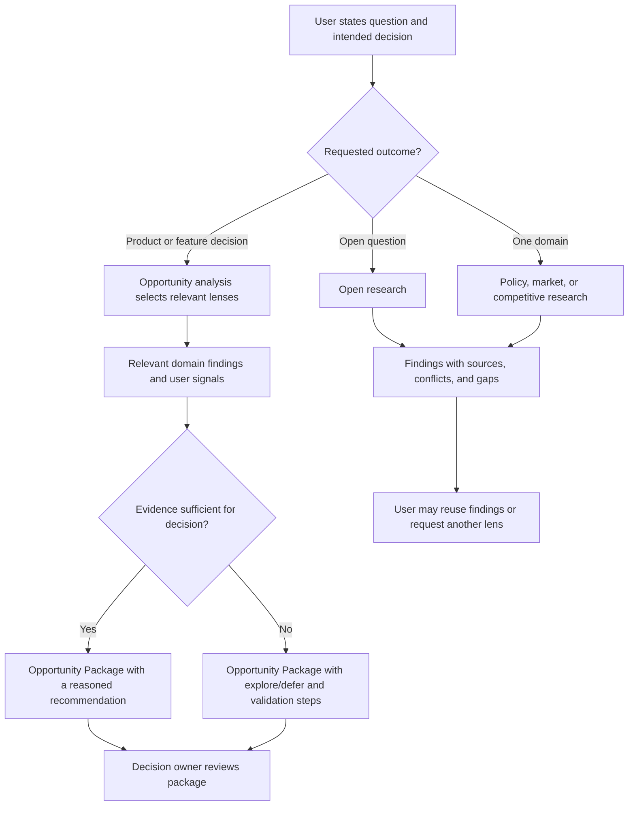

# Functional design: research skill user journeys

## Goal

A user can ask a research question or a product opportunity question and receive a scoped, evidence-linked result that makes uncertainty visible before a decision is made.

## Functional modules and boundaries

| Module | Responsibility | Boundary |
|---|---|---|
| Open research | Investigate a question and return reusable findings | Does not supply policy, market, competitor, or opportunity judgment |
| Policy research | Explain applicable instruments and their possible product impact | Does not issue a legal opinion |
| Market research | Define a market and report demand, structure, trends, and defensible sizing | Does not assume a precise size where the method or data is weak |
| Competitive research | Compare a stated competitor set against dated criteria | Does not treat undocumented capability as absent |
| Opportunity analysis | Select relevant research lenses and deliver an Opportunity Package for a product or feature question | Does not approve a roadmap item, a requirement, or product funding |

The first four modules can finish independently. Opportunity analysis consumes their findings and the user's supplied signals when relevant. The shared evidence definitions live in the proposed research-evidence Spec, not in this workflow document.

## Business workflow

The user can invoke any of the five public names directly. A natural-language request follows the branch that matches its desired output (Covers R1-R3). The research agent states material scope assumptions before presenting findings; it does not treat a missing lane as complete (Covers R4-R5).

## Exception and edge scenarios

- **Jurisdiction or market boundary omitted**: if the omission changes applicability, the agent asks for it or states a bounded assumption and marks the result limited; it does not present one country's rule as universal (Covers R4).
- **Sources conflict**: the result retains both positions, explains the disputed dimension, and shows how the conflict affects the decision (Covers R4).
- **Source inaccessible or permission-gated**: the result marks the evidence gap. The agent asks for access only when the source is necessary and follows the existing authorization rule (Covers R5-R6).
- **User asks for an opportunity judgment but only one research lane is relevant**: the package marks the other lanes `not_applicable` with reasons; the available lane and user signals determine whether the outcome is `explore`, `defer`, or a stronger recommendation (Covers R3-R5).
- **Repeated or updated research request**: a dated result may be reused only if its scope and freshness fit; otherwise the agent refreshes the affected findings and preserves the earlier report as historical context.

## Roles and permission matrix

| Role | Menu / entry | Operation | Data |
|---|---|---|---|
| Requesting user | May invoke the five public entries | May request research and review a package; may accept it only if also the decision owner | May supply only material they are authorized to share |
| Research agent | May route to public entries and internal assessment | May research and recommend; may not approve a product decision | May access supplied or public material within host and project authorization |
| Decision owner | May invoke the five public entries | May accept, reject, or request validation of a package | May review package evidence and share only authorized material |

No new application permission mechanism is introduced. The matrix describes the business boundary of the research workflow; actual access remains under the host and project rules.

## Acceptance criteria

- [ ] A direct open-research request ends with findings, sources, conflicts, and gaps, and no product verdict (Covers AIC-REQ-01 acceptance criterion 2).
- [ ] Each direct domain request ends with its own focused report; a product opportunity request ends with an Opportunity Package and lane statuses (Covers AIC-REQ-01 acceptance criterion 2).
- [ ] The package links its decision-critical statements to findings or marks them Unknown, and conflicts remain visible (Covers AIC-REQ-01 acceptance criteria 3 and 6).
- [ ] A missing decisive user signal or inaccessible material produces a validation step or a restrained recommendation rather than a manufactured positive case (Covers AIC-REQ-01 acceptance criteria 6 and 7).
- [ ] The decision owner can use the package as input to a later requirement without treating the package itself as approval (Covers AIC-REQ-01 acceptance criterion 8).
- [ ] A user can find the open, single-domain, and opportunity routes from the README and stage guide, then follow a matching example in the research usage guide (Covers AIC-REQ-01 acceptance criterion 9).

## Trade-offs and open questions

- **Five public entries versus a single research command**: five entries let expert users request just the work they need and allow open research without a product framing. The cost is more names to discover; the guide and natural-language routing reduce that cost.
- **Package with incomplete lanes versus forcing all three domains**: allowing an explicitly limited package avoids wasted investigation and lets an opportunity be deferred honestly. The cost is that the decision owner must read lane status before acting.
- **Naming decision**: [ADR 0013](../adr/0013-research-skill-entry-names.md) confirms the five public names. The technical design references this functional design as its parent.
