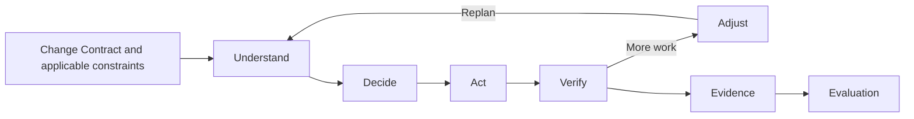
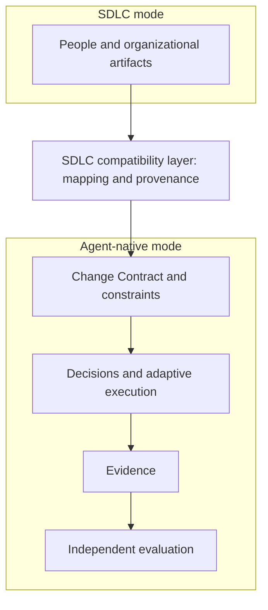

# Agent-Native Engineering: From SDLC Workflow to Adaptive Engineering

This RFC proposes an engineering model that AI Cortex can define and adopting execution and evaluation systems can use. It defines architectural direction without changing existing asset contracts or requiring an adopter's implementation. [ADR 0015](../adr/0015-agent-engineering-governance-model.md) records AI Cortex's accepted governance boundary; the cross-system model here remains proposed. The [illustrated guide](agent-native-engineering-explained.html) explains the idea, and the [adoption guide](../guides/agent-native-engineering-adoption.md) shows how a project can start with existing assets.

## Context

Many teams organize the software development life cycle (SDLC) around requirements, designs, tasks, implementation, review, and release. Those artifacts support accountability, coordination, acceptance, and audit. AI Cortex currently models several of them as canonical sources in [Artifact norms](../ARTIFACT_NORMS.md), and its [engineering quality guide](../guides/engineering-quality-governance.md) already allows small changes to omit design layers when their triggers are absent. Both facts must survive a transition.

Coding agents also learn material facts while exploring code, changing it, and running checks. A common Plan Mode pattern asks for a complete plan to be approved before that exploration, so the plan can become stale. Yet a purely local act-and-adjust loop can drift across architecture, data, security, or compatibility boundaries. Large or risky changes still need explicit design and human decisions.

The problem is how to let execution replan as evidence arrives while keeping stable intent, applicable constraints, reviewable decisions, and the organizational SDLC interfaces that people still use.

## Core Thesis

Planning is an ongoing activity; a plan document is one possible artifact. Plan Mode remains useful when advance design reduces material risk, but a complete static plan need not be the default for every change. Execution may revise its next steps when new information invalidates an assumption. Intent, acceptance conditions, architecture constraints, and consequential decisions require more stability than the step list.

Governance should increasingly state the permitted outcome and operating boundaries, then check what happened. This is a proposed shift in emphasis from prescribing every process step to governing constraints, escalation, and evidence. It does not remove required approvals, designs, or audit records. Their need depends on risk and organizational obligations.

| Classification | Statement | Status in this repository |
| --- | --- | --- |
| Existing authority | AI Cortex owns reusable Spec, Protocol, Skill, and Rule assets; its current artifact paths and canonical sources remain governed by [Artifact norms](../ARTIFACT_NORMS.md) and [core terminology](../architecture/terminology.md). | In force |
| Proposed architectural decision | Use a Change Contract as the stable reference for a bounded change, with linked constraints, decisions, execution state, evidence, and evaluation. An adopter may make its concrete schema authoritative for its own changes. | Proposed here; no universal schema is imposed |
| Proposed architectural decision | Keep an SDLC Compatibility Layer so current organizational artifacts and agent execution can coexist. An adopter may designate a document projection as the authoritative artifact for a defined purpose. | Proposed here; each adopter declares its own authority and transition rules |
| Proposed architectural decision | Separate governance definitions, execution, and independent evaluation across participating systems. | Proposed integration boundary, subject to each adopter's own decision process |
| Proposed architectural decision | Keep routine schema, projection, and execution changes under the adopting project's delegated authority; share only semantics needed for interoperability. | Proposed here; AI Cortex is not a central approval gate |
| Hypothesis | For suitable changes, adaptive execution with risk-triggered design will reduce rework or review burden without lowering acceptance or quality. | Assess through adoption experience; not an established outcome |

The architecture permits concrete schemas and authoritative projections. It does not require every adopter to use one schema or wait for AI Cortex to approve each local revision. A shared Spec is warranted when multiple systems need a stable exchange contract; project-specific fields, thresholds, and document mappings remain with the adopting project. Compatibility changes at a shared boundary require coordination with affected consumers, not blanket approval of unrelated work.

## Durable Artifacts

The following categories describe information that must survive replanning. They do not create new AI Cortex directories or a universal schema. An adopting project can define a concrete schema as its authoritative Change Contract definition; reusable cross-project definitions, when needed, belong to existing AI Cortex [asset types](../architecture/terminology.md).

| Category | Minimum durable meaning | Why it persists |
| --- | --- | --- |
| Change Contract | Intent, scope, exclusions, acceptance conditions, owner, and links to applicable constraints | Anchors the requested outcome when execution steps change |
| Constraints | Applicable project and organization rules, protected interfaces, architecture boundaries, and approval limits, with source references | Defines what execution may not violate |
| Decisions | A material question, alternatives, rationale, authority, outcome, and effect on the contract | Makes consequential choices reviewable and recoverable |
| Evidence | A trace from each acceptance or constraint claim to a change, test, inspection, runtime observation, or acknowledged gap, including result and provenance | Lets a reviewer distinguish verified outcomes from agent assertions |
| Evaluation | Findings and disposition against the contract and constraints, referencing the evidence inspected | Supports an independent completion judgment |

Execution state holds current hypotheses, discovered context, next actions, completed actions, and blockers. It can be revised frequently; a task list is not automatically a permanent artifact. A durable decision or evidence link must survive those revisions. Each adopter can define fields, storage, identifiers, and lifecycle rules to fit its own implementation, while preserving any shared interface it has explicitly adopted.

The Change Contract is stable **within an approved scope**, not immutable. A change to intent, acceptance, or a protected constraint requires an explicit amendment and, where applicable, renewed human authorization. This prevents replanning from silently changing the requested outcome.

## Adaptive Execution Model

Verification feeds both replanning and the evidence used for evaluation.

1. **Understand:** inspect the request, repository, constraints, and uncertainty. Record assumptions that could alter the approach.
2. **Decide:** choose the next bounded action. Persist material design choices and escalate those outside delegated authority.
3. **Act:** execute within the contract and applicable controls.
4. **Verify:** gather direct evidence against acceptance conditions and relevant constraints; record failures and gaps.
5. **Adjust:** revise the next actions from the evidence. Amend the contract only through the appropriate authority.

Completion requires a current evaluation of the final change and its evidence. A long upfront plan remains useful when it reduces risk: for example, changes to service boundaries, authorization, shared data models, migration paths, or external contracts. Risk-triggered design is compatible with continuous replanning.

## Human Escalation

The agent may choose local, reversible implementation steps when they fit the approved contract and constraints. Routine local schema and projection changes within delegated authority do not trigger escalation merely because they change a document or data shape. The agent must stop the affected action and present a decision when authority, intent, or consequences exceed that scope. The table describes candidate policy triggers; precise thresholds and approvers must be defined by the adopting project or organization.

| Trigger | Proposed response |
| --- | --- |
| Ambiguous intent or conflicting acceptance conditions | Clarify with the request owner before choosing an interpretation |
| Material change to architecture, service boundary, agreed shared interface, protected data model, or permission model | Present options, impact, and recommendation to the designated decision owner |
| Breaking external interface, destructive data action, or hard-to-reverse operation | Obtain explicit authorization before the affected action |
| Security or compliance boundary without a clear applicable rule | Stop the affected action and escalate to the accountable owner |
| Evidence cannot establish an acceptance condition or a required quality gate | Report the gap; do not claim verified completion |

An escalation should identify the exact question, feasible options, recommendation, affected contract terms, expected impact, reversibility, and evidence available. Review the consequential choice rather than every small execution step. Existing repository and organization approval rules take precedence over this proposed default.

## Dual-Mode Engineering Architecture

The proposed compatibility layer keeps organizational SDLC artifacts connected to an adaptive execution core:

**SDLC Mode** preserves the artifacts, approvals, and handoffs an organization needs today. **Agent-native Mode** works from intent and constraints, replans execution, and supplies evidence for evaluation. The compatibility layer translates between them while preserving provenance and the authority declared by the adopting project.

An adopter can begin with a one-way mapping from an existing requirement, design, or task to change information, then generate document projections where useful. It can also designate a generated requirement, design, or task view as the authoritative artifact for a defined audience and scope. The adopter must declare which record is authoritative for each kind of information, how the projection is produced and versioned, and how omissions, human edits, and conflicts are handled. A projection must carry enough provenance for a reader to trace its governing contract and decisions. These safeguards prevent two independently maintained sources from making competing claims without requiring central approval for every projection change.

This is a target architecture, not a change to AI Cortex's current document authority. Within AI Cortex, [Artifact norms](../ARTIFACT_NORMS.md) continue to govern canonical paths and sources until changed through this repository's normal rules. Another project makes the equivalent declaration in its own governance; it does not need AI Cortex to approve each project-local schema or projection.

## Project Boundaries

| Role | Proposed responsibility | Boundary |
| --- | --- | --- |
| AI Cortex | Define reusable governance semantics through its existing Specs, Protocols, Rules, and Skills when a shared interface or constraint is needed | Does not own another project's schema revisions, document authority, execution state, review runs, or instance evidence |
| Adopting execution system | Define its local Change Contract schema and projection authority; execute a bounded change, maintain adaptive runtime state, collect evidence, invoke escalation and evaluation, and assemble release output | Consumes any shared interface it adopts; does not make itself the sole judge of its own success |
| Independent evaluation system | Evaluate a change against intent, constraints, decisions, and evidence, returning findings and an evaluation result | Does not own the execution loop or redefine the governing contract |

These boundaries are recommendations for future adoption, not claims that any implementation already exposes these interfaces. A shared semantic contract should avoid dependencies on one system's runtime representation.

## Migration Strategy

The levels describe modes of adoption, not mandated versions or dates. A team can retain a lower level where risk, regulation, or coordination calls for it.

| Level | Operating model | Admission to the next level |
| --- | --- | --- |
| **L1 — SDLC Assisted** | Requirements, designs, tasks, review, and release remain the working structure; agents assist within existing gates. | Select a bounded change and establish an explicit contract, escalation owner, and acceptance evidence. |
| **L2 — Adaptive SDLC** | The organization keeps SDLC artifacts; the agent executes from a Change Contract and creates or updates design and tasks when their triggers arise. Evidence and material decisions are linked to acceptance. | Demonstrate reliable provenance, risk-triggered escalation, independent evaluation, and usable SDLC handoffs. |
| **L3 — Agent-native Engineering** | Intent, constraints, decisions, execution, evidence, and evaluation form the working core; SDLC artifacts are projected when organizational consumers need them and may be authoritative under the adopter's declared policy. | Adopt when the project has a clear authority, provenance, audit, and conflict-resolution model. |

L2 is the near-term adoption path. L3 is a proposed operating model whose effectiveness remains unproven. No level removes an approval or artifact that a project currently requires without that project's own decision.

## Adoption and Revision

Adopting systems may apply this proposal through their own architecture and delivery decisions. They can retain existing SDLC interfaces while introducing the Change Contract, adaptive execution, and evidence links incrementally.

When adoption reveals a material mismatch, update this RFC with the observed constraint, the revised proposal, and its compatibility impact. Project-specific schemas, projections, and approval thresholds remain local. Add a shared Spec, Protocol, or Rule only when a reusable contract or constraint becomes clear; do not make publication here a prerequisite for routine project work.

This RFC does not mandate shared schema fields, escalation thresholds, evidence identifiers, or contract versioning. Adopters settle these details as concrete needs arise, record local authority for any canonical projection, and coordinate only changes that affect an agreed shared interface. A change to AI Cortex's own canonical artifacts still follows the relevant repository rules.
