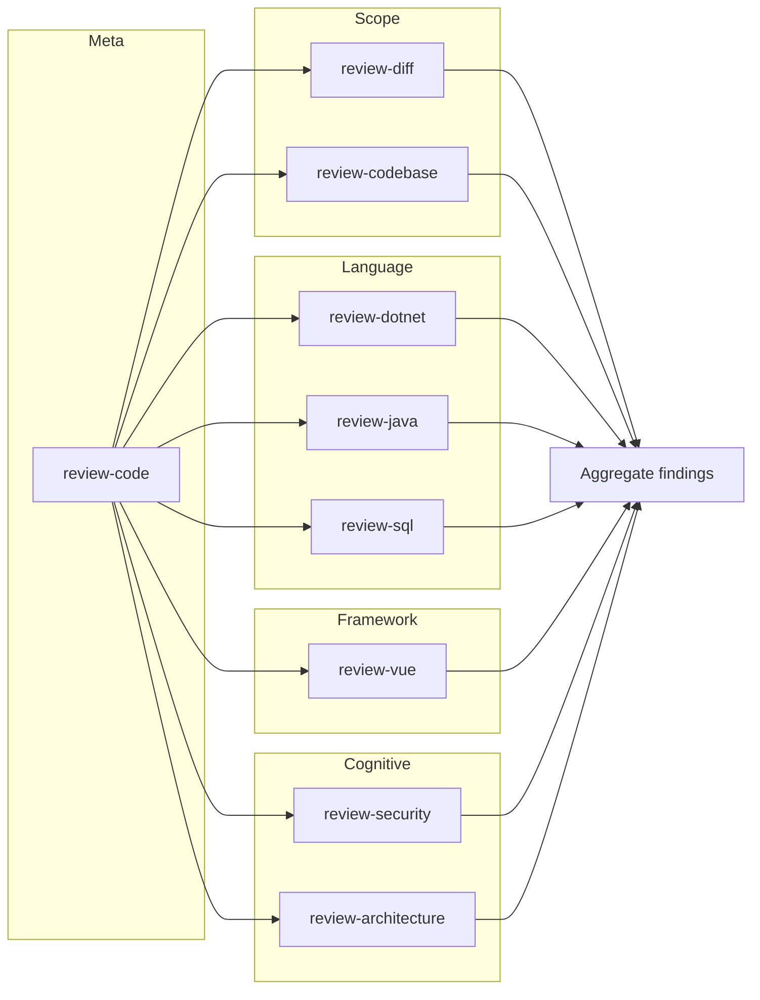

# Code Review Skills: Composition Graph

This document describes how the **code review** skills compose. It is for human and Agent reading only; Skills.sh and the manifest do not depend on it. For the canonical skill list, see [INDEX.md](./INDEX.md) and [manifest.json](../manifest.json).

---

## 1. Skill types

Atomic review skills are grouped by dimension:

| Type | Description | Skills |
| :--- | :--- | :--- |
| **Scope** | What to review: current change (diff) or current state (paths/repo). | [review-diff](./review-diff/SKILL.md), [review-codebase](./review-codebase/SKILL.md) |
| **Language** | Language and runtime conventions. | [review-dotnet](./review-dotnet/SKILL.md), [review-java](./review-java/SKILL.md), [review-sql](./review-sql/SKILL.md) |
| **Framework** | Application framework conventions. | [review-vue](./review-vue/SKILL.md); *(reserved: review-aspnetcore, review-react, etc.)* |
| **Library** | Key library usage and pitfalls. | *(reserved: review-entityframework, etc.)* |
| **Cognitive** | Cross-cutting concerns: security, architecture, etc. | [review-security](./review-security/SKILL.md), [review-architecture](./review-architecture/SKILL.md) |
| **Meta** | Orchestration only; no analysis. | [review-code](./review-code/SKILL.md) |

---

## 2. Execution order

When running a **full** code review (via [review-code](./review-code/SKILL.md)), the execution order is:

1. **Scope** → choose one: `review-diff` (current change) or `review-codebase` (given paths/repo).
2. **Language** → choose one or none: `review-dotnet`, `review-java`, `review-sql` (by project).
3. **Framework** → optional: `review-vue` or future framework skills.
4. **Library** → optional: future library skills (e.g. review-entityframework).
5. **Cognitive** → run in order: `review-security`, then `review-architecture` (and future: reliability, maintainability).

All findings from the steps above are **aggregated** into a single report (same finding format: Location, Category, Severity, Title, Description, Suggestion).

---

## 3. Composition diagram

---

## 4. Finding format (shared)

Every atomic skill emits findings in this format so [review-code](./review-code/SKILL.md) can merge them:

- **Location**: `path/to/file.ext` (optional line or range)
- **Category**: scope | language-* | framework-* | library-* | cognitive-*
- **Severity**: critical | major | minor | suggestion
- **Title**: Short one-line summary
- **Description**: 1–3 sentences
- **Suggestion**: Concrete fix or improvement (optional)

---

## 5. Quick reference

| Skill | Type | Input | Output |
| :--- | :--- | :--- | :--- |
| [review-diff](./review-diff/SKILL.md) | scope | git diff | Findings (Category=scope) |
| [review-codebase](./review-codebase/SKILL.md) | scope | paths/dirs/repo | Findings (Category=scope) |
| [review-dotnet](./review-dotnet/SKILL.md) | language | code scope | Findings (Category=language-dotnet) |
| [review-java](./review-java/SKILL.md) | language | code scope | Findings (Category=language-java) |
| [review-sql](./review-sql/SKILL.md) | language | SQL/code scope | Findings (Category=language-sql) |
| [review-vue](./review-vue/SKILL.md) | framework | code scope | Findings (Category=framework-vue) |
| [review-security](./review-security/SKILL.md) | cognitive | code scope | Findings (Category=cognitive-security) |
| [review-architecture](./review-architecture/SKILL.md) | cognitive | code scope | Findings (Category=cognitive-architecture) |
| [review-code](./review-code/SKILL.md) | meta | user intent + scope | Single aggregated report |
