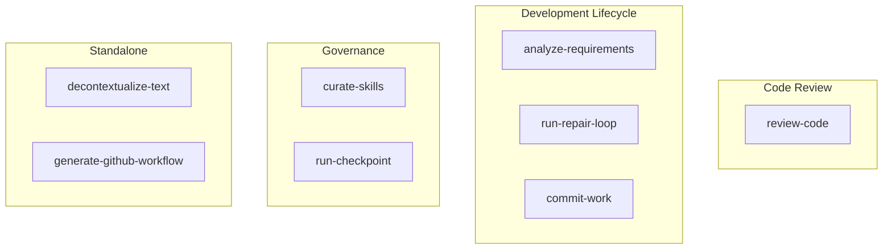
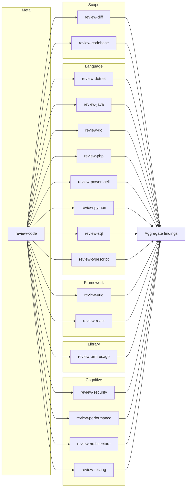
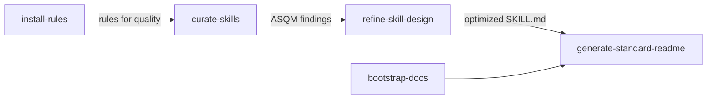
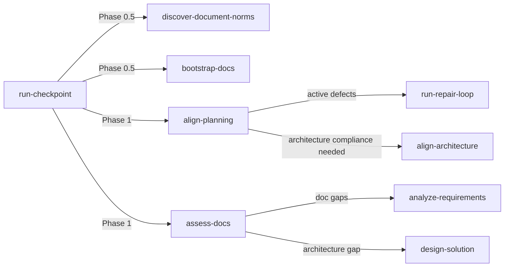

# Skill Composition Graph

*Auto-generated by `scripts/generate-skillgraph.mjs`. Do not edit manually.*

This document describes how skills compose into orchestration chains, governance workflows, and development pipelines. For human and Agent reading only; Skills.sh and the manifest do not depend on it. For the canonical skill list, see [INDEX.md](./INDEX.md) and [manifest.json](../manifest.json). For scenario-first routing, see [scenario-map.md](./scenario-map.md).

---

## 1. Global overview

The skill ecosystem has four major domains:

| Domain | Purpose | Entry skills |
| :--- | :--- | :--- |
| **Code Review** | Aggregate scope, language, framework, library, and cognitive findings | [review-code](./review-code/SKILL.md) |
| **Development Lifecycle** | Requirements → design → implementation → review → commit | [analyze-requirements](./analyze-requirements/SKILL.md), [run-repair-loop](./automate-repair/SKILL.md), [commit-work](./commit-work/SKILL.md) |
| **Governance & Curation** | Skill inventory, docs, project governance | [curate-skills](./curate-skills/SKILL.md), [run-checkpoint](./plan-next/SKILL.md) |
| **Standalone** | Single-skill tasks | [decontextualize-text](./decontextualize-text/SKILL.md), [generate-github-workflow](./generate-github-workflow/SKILL.md), [capture-work-items](./capture-work-items/SKILL.md), etc. |

```mermaid
flowchart TB
  subgraph review [Code Review]
    rc[review-code]
  end
  subgraph lifecycle [Development Lifecycle]
    req[analyze-requirements]
    repair[run-repair-loop]
    commit[commit-work]
  end
  subgraph governance [Governance]
    curate[curate-skills]
    loop[run-checkpoint]
  end
  subgraph standalone [Standalone]
    dectx[decontextualize-text]
    gwf[generate-github-workflow]
  end
```

---

## 2. Skill types (Code Review)

Atomic review skills are grouped by dimension:

| Type | Description | Skills |
| :--- | :--- | :--- |
| **Scope** | What to review: current change (diff) or current state (paths/repo). | [review-diff](./review-diff/SKILL.md), [review-codebase](./review-codebase/SKILL.md) |
| **Language** | Language and runtime conventions. | [review-dotnet](./review-dotnet/SKILL.md), [review-java](./review-java/SKILL.md), [review-go](./review-go/SKILL.md), [review-php](./review-php/SKILL.md), [review-powershell](./review-powershell/SKILL.md), [review-python](./review-python/SKILL.md), [review-sql](./review-sql/SKILL.md), [review-typescript](./review-typescript/SKILL.md) |
| **Framework** | Application framework conventions. | [review-vue](./review-vue/SKILL.md), [review-react](./review-react/SKILL.md) |
| **Library** | Key library usage and pitfalls. | [review-orm-usage](./review-orm-usage/SKILL.md) |
| **Cognitive** | Cross-cutting concerns: security, performance, architecture, testing. | [review-security](./review-security/SKILL.md), [review-performance](./review-performance/SKILL.md), [review-architecture](./review-architecture/SKILL.md), [review-testing](./review-testing/SKILL.md) |
| **Meta** | Orchestration only; no analysis. | [review-code](./review-code/SKILL.md) |

---

## 3. Execution order

When running a **full** code review (via [review-code](./review-code/SKILL.md)), the execution order is:

1. **Scope** → choose one: `review-diff` (current change) or `review-codebase` (given paths/repo).
2. **Language** → choose one or none: review-dotnet, review-java, review-go, review-php, review-powershell, review-python, review-sql, review-typescript (by project).
3. **Framework** → optional: review-vue, review-react or future framework skills.
4. **Library** → optional: review-orm-usage or future library skills.
5. **Cognitive** → run in order: review-security, then review-performance, then review-architecture, then review-testing (and future: reliability, maintainability).

All findings from the steps above are **aggregated** into a single report (same finding format: Location, Category, Severity, Title, Description, Suggestion).

---

## 4. Composition diagram

```mermaid
flowchart LR
  subgraph meta [Meta]
    review_code[review-code]
  end
  subgraph scope [Scope]
    review_diff[review-diff]
    review_codebase[review-codebase]
  end
  subgraph lang [Language]
    review_dotnet[review-dotnet]
    review_java[review-java]
    review_go[review-go]
    review_php[review-php]
    review_powershell[review-powershell]
    review_python[review-python]
    review_sql[review-sql]
    review_typescript[review-typescript]
  end
  subgraph fw [Framework]
    review_vue[review-vue]
    review_react[review-react]
  end
  subgraph lib [Library]
    review_orm_usage[review-orm-usage]
  end
  subgraph cognitive [Cognitive]
    review_security[review-security]
    review_performance[review-performance]
    review_architecture[review-architecture]
    review_testing[review-testing]
  end
  review_code --> review_diff
  review_code --> review_codebase
  review_code --> review_dotnet
  review_code --> review_java
  review_code --> review_go
  review_code --> review_php
  review_code --> review_powershell
  review_code --> review_python
  review_code --> review_sql
  review_code --> review_typescript
  review_code --> review_vue
  review_code --> review_react
  review_code --> review_orm_usage
  review_code --> review_security
  review_code --> review_performance
  review_code --> review_architecture
  review_code --> review_testing
  review_diff --> aggregate[Aggregate findings]
  review_codebase --> aggregate[Aggregate findings]
  review_dotnet --> aggregate[Aggregate findings]
  review_java --> aggregate[Aggregate findings]
  review_go --> aggregate[Aggregate findings]
  review_php --> aggregate[Aggregate findings]
  review_powershell --> aggregate[Aggregate findings]
  review_python --> aggregate[Aggregate findings]
  review_sql --> aggregate[Aggregate findings]
  review_typescript --> aggregate[Aggregate findings]
  review_vue --> aggregate[Aggregate findings]
  review_react --> aggregate[Aggregate findings]
  review_orm_usage --> aggregate[Aggregate findings]
  review_security --> aggregate[Aggregate findings]
  review_performance --> aggregate[Aggregate findings]
  review_architecture --> aggregate[Aggregate findings]
  review_testing --> aggregate[Aggregate findings]
```

---

## 5. Finding format (shared)

Every atomic skill emits findings in this format so [review-code](./review-code/SKILL.md) can merge them:

- **Location**: `path/to/file.ext` (optional line or range)
- **Category**: `scope | language-* | framework-* | library-* | cognitive-*`
- **Severity**: critical | major | minor | suggestion
- **Title**: Short one-line summary
- **Description**: 1–3 sentences
- **Suggestion**: Concrete fix or improvement (optional)

---

## 6. Quick reference (review)

| Skill | Type | Input | Output |
| :--- | :--- | :--- | :--- |
| [review-diff](./review-diff/SKILL.md) | scope | git diff | Findings (Category=scope) |
| [review-codebase](./review-codebase/SKILL.md) | scope | paths/dirs/repo | Findings (Category=scope) |
| [review-dotnet](./review-dotnet/SKILL.md) | language | code scope | Findings (Category=language-dotnet) |
| [review-java](./review-java/SKILL.md) | language | code scope | Findings (Category=language-java) |
| [review-go](./review-go/SKILL.md) | language | code scope | Findings (Category=language-go) |
| [review-php](./review-php/SKILL.md) | language | code scope | Findings (Category=language-php) |
| [review-powershell](./review-powershell/SKILL.md) | language | code scope | Findings (Category=language-powershell) |
| [review-python](./review-python/SKILL.md) | language | code scope | Findings (Category=language-python) |
| [review-sql](./review-sql/SKILL.md) | language | code scope | Findings (Category=language-sql) |
| [review-typescript](./review-typescript/SKILL.md) | language | code scope | Findings (Category=language-typescript) |
| [review-vue](./review-vue/SKILL.md) | framework | code scope | Findings (Category=framework-vue) |
| [review-react](./review-react/SKILL.md) | framework | code scope | Findings (Category=framework-react) |
| [review-orm-usage](./review-orm-usage/SKILL.md) | library | code scope | Findings (Category=library-orm) |
| [review-security](./review-security/SKILL.md) | cognitive | code scope | Findings (Category=cognitive-security) |
| [review-performance](./review-performance/SKILL.md) | cognitive | code scope | Findings (Category=cognitive-performance) |
| [review-architecture](./review-architecture/SKILL.md) | cognitive | code scope | Findings (Category=cognitive-architecture) |
| [review-testing](./review-testing/SKILL.md) | cognitive | code scope | Findings (Category=cognitive-testing) |
| [review-code](./review-code/SKILL.md) | meta | user intent + scope | Single aggregated report |

---

## 7. Non-review composition chains

### 7.1 Development lifecycle chain

Requirements → Design → Implementation → Review → Commit

```mermaid
flowchart LR
  analyze[analyze-requirements]
  brainstorm[design-solution]
  review_code_node[review-code]
  commit[commit-work]
  run_tests[run-automated-tests]
  repair[run-repair-loop]

  analyze -->|validated requirements| brainstorm
  brainstorm -->|approved design| review_code_node
  review_code_node -->|findings| repair
  repair --> run_tests
  repair --> review_code_node
  run_tests -->|tests pass| commit
```

### 7.2 Governance and curation chain

```mermaid
flowchart LR
  curate[curate-skills]
  refine[refine-skill-design]
  readme_gen[generate-standard-readme]
  bootstrap[bootstrap-docs]
  install[install-rules]

  curate -->|ASQM findings| refine
  refine -->|optimized SKILL.md| readme_gen
  bootstrap --> readme_gen
  install -.->|rules for quality| curate
```

### 7.3 Project governance loop chain

Phase 0.5: discover-document-norms, bootstrap-docs. Unified sequence: align-planning → assess-docs. Output-driven follow-ups: align-architecture, repair, brainstorm, analyze.

```mermaid
flowchart LR
  loop[run-checkpoint]
  discover[discover-document-norms]
  bootstrap[bootstrap-docs]
  align[align-planning]
  alignarch[align-architecture]
  docreadiness[assess-docs]
  req[analyze-requirements]
  design[design-solution]
  repair[run-repair-loop]

  loop -->|Phase 0.5| discover
  loop -->|Phase 0.5| bootstrap
  loop -->|Phase 1| align
  loop -->|Phase 1| docreadiness
  align -->|active defects| repair
  align -->|architecture compliance needed| alignarch
  docreadiness -->|doc gaps| req
  docreadiness -->|architecture gap| design
```

### 7.4 Quick reference (non-review)

| Skill | Chain | Input | Output |
| :--- | :--- | :--- | :--- |
| [analyze-requirements](./analyze-requirements/SKILL.md) | lifecycle | vague intent | validated requirements doc |
| [design-solution](./design-solution/SKILL.md) | lifecycle | requirements doc | design doc (no implementation) |
| [breakdown-tasks](./breakdown-tasks/SKILL.md) | lifecycle | design doc | tasks.md / task list |
| [commit-work](./commit-work/SKILL.md) | lifecycle | staged changes | git commits |
| [run-automated-tests](./automate-tests/SKILL.md) | lifecycle | repo path | test execution results |
| [run-repair-loop](./automate-repair/SKILL.md) | lifecycle | repo + scope | converged clean state |
| [align-planning](./align-planning/SKILL.md) | lifecycle | completed task context | planning alignment report |
| [align-architecture](./align-architecture/SKILL.md) | lifecycle | ADR/design scope + code scope | architecture compliance report |
| [assess-docs](./assess-docs/SKILL.md) | lifecycle | docs scope + mapping | doc assessment report (compliance findings + readiness + minimal fill plan) |
| [run-checkpoint](./plan-next/SKILL.md) | lifecycle | trigger + project context | cycle report |
| [generate-standard-readme](./generate-standard-readme/SKILL.md) | onboarding, governance | project context | standardized README |
| [generate-agent-entry](./generate-agent-entry/SKILL.md) | onboarding | project context | AGENTS.md |
| [discover-skills](./discover-skills/SKILL.md) | onboarding | capability gaps | skill recommendations |
| [curate-skills](./curate-skills/SKILL.md) | governance | skills directory | ASQM audit report |
| [refine-skill-design](./refine-skill-design/SKILL.md) | governance | SKILL.md | optimized SKILL.md |
| [bootstrap-docs](./bootstrap-docs/SKILL.md) | governance | project directory | docs tree |
| [install-rules](./install-rules/SKILL.md) | governance | source rules | IDE rule files |
| [decontextualize-text](./decontextualize-text/SKILL.md) | standalone | private text | generic text |
| [generate-github-workflow](./generate-github-workflow/SKILL.md) | standalone | workflow requirements | GitHub Actions YAML |
| [capture-work-items](./capture-work-items/SKILL.md) | standalone | free-form input | structured work item(s) |
| [discover-document-norms](./discover-docs-norms/SKILL.md) | standalone | project path | docs/ARTIFACT_NORMS.md |
